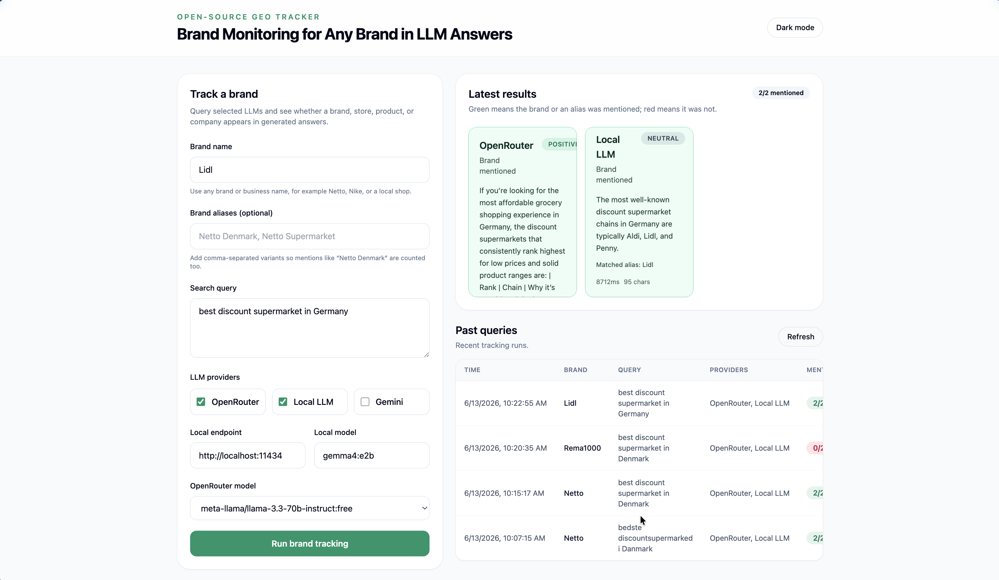
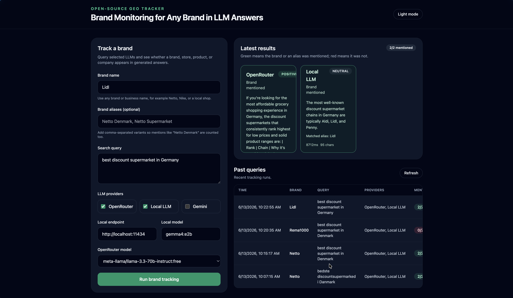
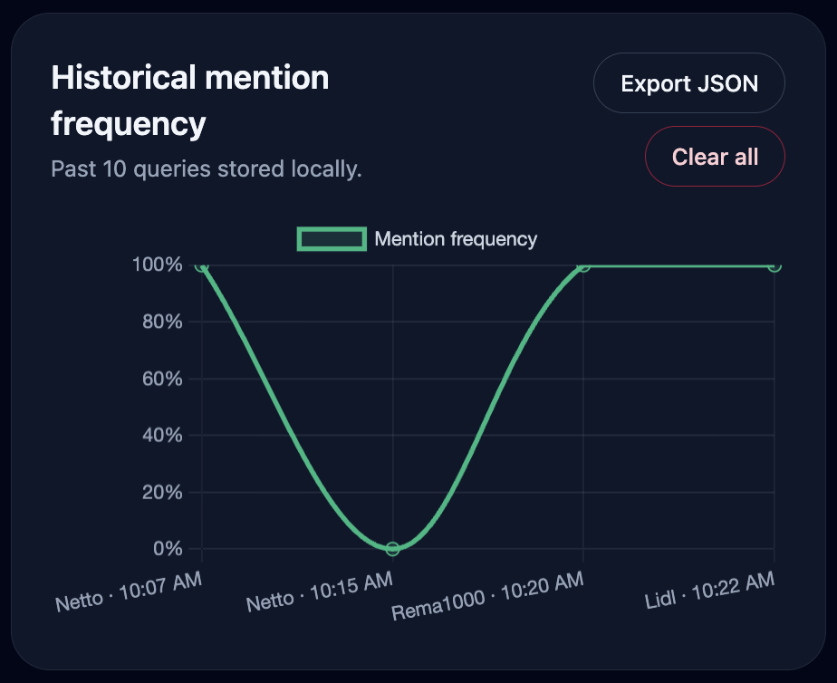

# Open-Source GEO Tracker

**Open-Source GEO Tracker** is a full-stack TypeScript web app for monitoring how any brand, store, product, company, or topic appears in responses from different large language models. GEO, or **Generative Engine Optimization**, is the practice of improving how a brand or entity is represented inside AI-generated answers. As more users ask LLMs for recommendations, comparisons, and summaries, brand visibility in those answers can influence discovery, trust, and purchasing decisions.

This portfolio project demonstrates a production-minded approach to brand monitoring:

- Querying multiple LLM providers from a single dashboard.
- Tracking any brand name, not just one fixed demo brand.
- Supporting optional brand aliases such as `Netto Denmark` or `Netto Supermarket`.
- Recording brand mentions, matched aliases, sentiment, latency, and response snippets.
- Visualizing historical mention frequency.
- Exporting tracking history as JSON, CSV, or PDF report.
- Running with free-tier APIs, local LLMs, or mock data when no API key is configured.
- Keeping API keys out of source code.

## Screenshots

### Dashboard



### Dark mode



### History




## Project Structure

```txt
geo-tracker/
├─ backend/
│  ├─ package.json
│  ├─ tsconfig.json
│  └─ src/
│     ├─ config/
│     │  └─ env.ts
│     ├─ routes/
│     │  └─ track.ts
│     ├─ services/
│     │  ├─ analysis.ts
│     │  ├─ history.ts
│     │  ├─ mockResponses.ts
│     │  ├─ sentiment.ts
│     │  ├─ track.ts
│     │  └─ providers/
│     │     ├─ gemini.ts
│     │     ├─ local.ts
│     │     └─ openrouter.ts
│     ├─ types.ts
│     ├─ utils/
│     │  ├─ delay.ts
│     │  └─ retry.ts
│     └─ server.ts
├─ frontend/
│  ├─ package.json
│  ├─ index.html
│  ├─ tailwind.config.js
│  ├─ postcss.config.js
│  ├─ tsconfig.json
│  ├─ tsconfig.node.json
│  ├─ vite.config.ts
│  └─ src/
│     ├─ api.ts
│     ├─ App.tsx
│     ├─ main.tsx
│     ├─ styles.css
│     ├─ types.ts
│     ├─ components/
│     │  ├─ HistoryTable.tsx
│     │  └─ ProviderCard.tsx
│     └─ utils/
│        └─ exportReports.ts
├─ docs/
│  └─ screenshots/
│     ├─ dashboard-placeholder.md
│     ├─ dashboard.png
│     ├─ dashboard-dark.png
│     ├─ history.png
│     ├─ report-export.png
│     └─ ml-sentiment.png
├─ package.json
├─ package-lock.json
├─ .env.example
├─ .gitignore
└─ README.md
```

## Architecture

```txt
┌────────────────────────────┐
│ React + Vite Frontend       │
│ Tailwind + Chart.js         │
│ JSON / CSV / PDF exports    │
└─────────────┬──────────────┘
              │ HTTP JSON
              ▼
┌────────────────────────────┐
│ Express API Backend         │
│ /api/track + history        │
│ Zod validation              │
└───────┬──────────┬─────────┘
        │          │
        │          ▼
        │     JSON history file
        │
        ▼
┌────────────────────────────────────────────────┐
│ Provider + Analysis Layer                       │
│ OpenRouter / Local LLM / Gemini                 │
│ Brand mention detection with optional aliases   │
│ ML sentiment model with keyword fallback        │
│ Mock fallback when provider keys are missing    │
└────────────────────────────────────────────────┘
```

## Features

- Brand monitoring form with brand name, optional aliases, query, and provider selection.
- Any-brand tracking, for example `Netto`, `Nike`, or a local shop.
- Optional brand aliases so variants such as `Netto Denmark` are counted as mentions.
- Provider checkboxes for:
  - **OpenRouter** free-tier LLMs with model picker
  - **Local LLM** via Ollama or an OpenAI-compatible local endpoint
  - **Google Gemini**
- Backend retry logic with exponential backoff, max 3 retries.
- Graceful rate-limit and provider-error handling.
- Whole-word, case-insensitive brand mention detection.
- ML-assisted positive/neutral/negative sentiment scoring with keyword fallback.
- 500-character response snippets.
- Result cards color-coded by brand mention status and sentiment.
- Matched alias display on provider result cards.
- Historical mention-frequency line chart.
- Local JSON history file storing the last 10 queries.
- Dark/light mode toggle.
- JSON, CSV, and PDF exports for history and reports.
- Mock fallback when API keys are not configured.

## API

### `POST /api/track`

Request:

```json
{
  "brand": "Netto",
  "aliases": ["Netto Denmark", "Netto Supermarket"],
  "query": "best discount supermarket in Denmark",
  "providers": ["openrouter", "local"],
  "localEndpoint": "http://localhost:11434",
  "localModel": "gemma4:e2b",
  "openRouterModel": "google/gemma-4-31b-it:free"
}
```

Response:

```json
{
  "id": "uuid",
  "brand": "Netto",
  "aliases": ["Netto Denmark", "Netto Supermarket"],
  "query": "best discount supermarket in Denmark",
  "providers": ["openrouter", "local"],
  "createdAt": "2026-06-11T00:00:00.000Z",
  "results": [
    {
      "provider": "openrouter",
      "mentioned": true,
      "matchedAlias": "Netto Denmark",
      "sentiment": "positive",
      "snippet": "For \"best discount supermarket in Denmark\", Netto Denmark is a relevant option...",
      "rawResponse": "For \"best discount supermarket in Denmark\", Netto Denmark is a relevant option...",
      "latencyMs": 842,
      "mocked": false
    }
  ]
}
```

### `GET /api/track/history`

Returns the past 10 tracking records stored in the local JSON history file.

### `DELETE /api/track/history/:id`

Deletes one tracking record from local history.

### `DELETE /api/track/history`

Clears all local tracking history.

## Setup Instructions

### Prerequisites

- Node.js 18 or newer.
- npm, Yarn, or pnpm.
- Optional: Ollama or LM Studio for local LLM testing.

### 1. Clone the project

```bash
git clone <your-repo-url>
cd geo-tracker
```

### 2. Install dependencies

```bash
npm install
```

### 3. Configure environment variables

Copy the example environment file:

```bash
cp .env.example .env
```

Minimum variables:

```env
PORT=3001
GEMINI_API_KEY=
DATA_FILE=./data/history.json
```

Optional OpenRouter key file:

```env
OPENROUTER_API_KEY=your_openrouter_key_here
```

Optional ML sentiment settings:

```env
ENABLE_ML_SENTIMENT=true
SENTIMENT_MODEL=Xenova/distilbert-base-uncased-finetuned-sst-2-english
SENTIMENT_MAX_CHARS=512
```

The app works without keys by returning mock responses. To use real free-tier APIs, add your keys to `.env`. You can keep `OPENROUTER_API_KEY` in the separate `.env.openrouter` file instead; that file is ignored by Git.

### 4. Run the development servers

```bash
npm run dev
```

Open:

- Frontend: `http://localhost:5173`
- Backend health check: `http://localhost:3001/health`

### 5. Build for production

```bash
npm run build
```

## LLM Integrations

### OpenRouter

OpenRouter is the preferred cloud provider for this project because it exposes multiple models through one OpenAI-compatible chat completions endpoint, including the free-tier models selected for this app.

Get a free API key:

1. Visit <https://openrouter.ai/>.
2. Create or sign in to your account.
3. Generate an API key.
4. Add it to `.env.openrouter`:

```env
OPENROUTER_API_KEY=your_openrouter_key_here
```

The backend also loads `.env`, but `.env.openrouter` is used for the OpenRouter key so you can keep it separate and ignored by Git.

The backend sends requests to:

```txt
https://openrouter.ai/api/v1/chat/completions
```

The frontend model picker supports these free-tier OpenRouter models:

```txt
google/gemma-4-31b-it:free
openai/gpt-oss-120b:free
meta-llama/llama-3.3-70b-instruct:free
nex-agi/nex-n2-pro:free
```

The default model is `google/gemma-4-31b-it:free`. You can also set `OPENROUTER_MODEL` in `.env` to one of the allowed models above.

### Google Gemini

Gemini is available through Google AI Studio and has a free tier for eligible usage.

Get a free API key:

1. Visit <https://aistudio.google.com/>.
2. Create or sign in to your Google account.
3. Create an API key.
4. Add it to `.env`:

```env
GEMINI_API_KEY=your_gemini_key_here
GEMINI_MODEL=gemini-2.0-flash
```

The backend sends requests to Google's Generative Language API.

### Local LLM Option

The local provider supports:

- **Ollama**: `http://localhost:11434`
- **OpenAI-compatible local servers** such as LM Studio: `http://localhost:1234/v1`

Example Ollama setup:

```bash
ollama pull gemma4:e2b
ollama serve
```

Then configure the frontend local endpoint:

```txt
Endpoint: http://localhost:11434
Model: gemma4:e2b
```

For LM Studio:

1. Start the local server.
2. Use an OpenAI-compatible endpoint, commonly `http://localhost:1234/v1`.
3. Enter the model name shown by LM Studio.

## ML Sentiment Model

Sentiment analysis uses `@xenova/transformers` to download a lightweight Hugging Face model on first use. The default model is:

```txt
Xenova/distilbert-base-uncased-finetuned-sst-2-english
```

You can configure it in `.env`:

```env
ENABLE_ML_SENTIMENT=true
SENTIMENT_MODEL=Xenova/distilbert-base-uncased-finetuned-sst-2-english
SENTIMENT_MAX_CHARS=512
```

Behavior:

- The backend downloads the public model weights from Hugging Face on first use.
- Sentiment inference runs locally in the backend.
- Response text is not sent to Hugging Face for sentiment classification.
- If `ENABLE_ML_SENTIMENT=false`, the backend uses keyword sentiment scoring only.
- If the model cannot be downloaded or loaded, the backend falls back to keyword sentiment scoring.

## Example Query

Use these values in the dashboard to track Netto in Denmark:

```txt
Brand: Netto
Aliases: Netto Denmark, Netto Supermarket
Query: best discount supermarket in Denmark
Providers: OpenRouter, Local LLM
```

The backend sends each provider a natural search query without injecting the brand into the prompt. It then checks whether the brand name or any configured alias appears in the generated answer.

Expected frontend behavior:

- If OpenRouter mentions Netto or a configured alias, its card appears green.
- If Local LLM does not mention Netto or any alias, its card appears red.
- The history chart updates with the latest mention-frequency point.
- Provider cards show sentiment and any matched alias.

## Export Options

The history section includes three export formats:

- **Export JSON** — full tracking records, including raw responses.
- **Export CSV** — one row per provider result with brand, alias, query, provider, mention status, sentiment, latency, snippet, raw response, and error details.
- **Export PDF** — a client-side report with brand summary, run details, and provider results.

PDF generation uses `jspdf` and `jspdf-autotable`. The PDF libraries are dynamically imported so they do not block the initial app bundle.

## Implementation Notes

### Backend

- Express + TypeScript.
- Zod validates `POST /api/track` payloads.
- Provider services are isolated behind a shared result shape.
- OpenRouter, Gemini, and Local LLM providers all share the same analysis pipeline.
- `retryWithBackoff` retries provider calls up to 3 times.
- Calls are spaced with a short delay to reduce accidental rate-limit bursts.
- Brand analysis checks the primary brand and optional aliases.
- Sentiment analysis uses a Hugging Face model through `@xenova/transformers`, with keyword fallback.
- History is stored in a JSON file rather than requiring a database.
- Local LLM provider supports both Ollama and OpenAI-compatible endpoints.

### Frontend

- React + TypeScript + Vite.
- Tailwind CSS for dashboard styling.
- Chart.js for historical mention frequency.
- Loading skeletons for in-flight provider calls.
- Error states for invalid input and provider failures.
- Dark/light mode toggle persisted in `localStorage`.
- `exportReports.ts` contains CSV and blob download helpers.
- PDF report generation is handled in `App.tsx` with `jspdf` and `jspdf-autotable`.

### Mock Fallback

If a provider API key is missing, the backend returns a mock response so the app remains usable for demos and portfolio reviews. Mock responses are marked with `mocked: true`. OpenRouter and Gemini follow this fallback behavior when their key is not configured; Local LLM falls back when the local endpoint is unavailable or returns an invalid response.

## Known Limitations

- The default ML sentiment model is English-oriented.
- The ML sentiment model is downloaded on first use and requires network access unless cached locally by the runtime.
- If ML sentiment cannot be loaded, the backend falls back to keyword scoring.
- Brand matching uses whole-word case-insensitive matching. Optional aliases help with variants, but it may still miss stylized brand names, abbreviations, or multilingual mentions.
- JSON history is intended for local demos, not high-volume production storage.
- The local LLM provider does not stream tokens to the UI; it waits for the complete local response.
- Free-tier APIs have rate limits and model availability differences by region/account.
- The prompt asks models to mention the brand "if appropriate"; this keeps responses natural but means mentions are not guaranteed.
- PDF reports are generated client-side and may vary slightly across browsers.

## Future Improvements

- Add SQLite persistence with migrations.
- Add result caching for identical queries for 1 hour.
- Add streaming UI for local LLM responses.
- Add more LLM providers such as Mistral, Anthropic, OpenAI, or Perplexity.
- Add entity disambiguation, e.g. Netto Denmark vs other Netto brands.
- Add scheduled monitoring and alerts.
- Add user accounts, project workspaces, and saved dashboards.
- Add server-side report generation.
- Add tests for analysis, provider parsing, API routes, CSV export, and PDF report generation.
- Add real dashboard, dark-mode, history, export, and sentiment screenshots.

## Security and Privacy Notes

- API keys are read only from environment variables.
- `.env` and `.env.openrouter` are ignored by Git.
- The app does not include hardcoded provider keys.
- Do not commit `.env` or local history if it contains sensitive brand queries.
- The sentiment model is downloaded from Hugging Face as public model weights; brand responses are classified locally in the backend.
